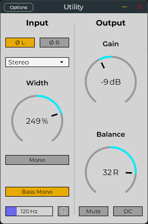

# JUCE Stereo Utility Plugin

A versatile stereo utility audio plugin built with the JUCE framework, heavily inspired by Ableton Live Utility device. It provides tools for controlling stereo width, gain, panning, phase, channel selection, and includes a dedicated Bass Mono section and Mid/Side balance mode.

## Downloads

Pre-compiled versions (VST3 x64 format) for Windows **[Utility.vst3](https://github.com/movedx/Utility/raw/refs/heads/main/Utility.vst3)**.
